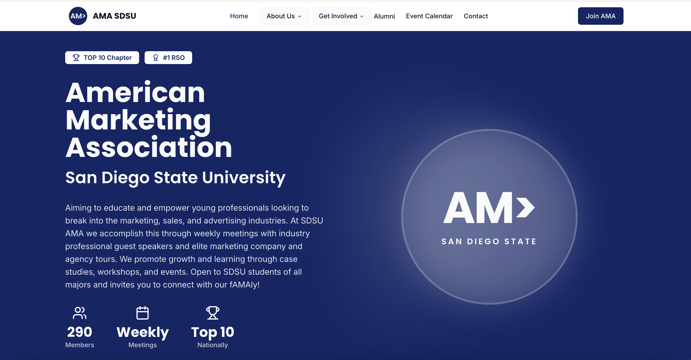
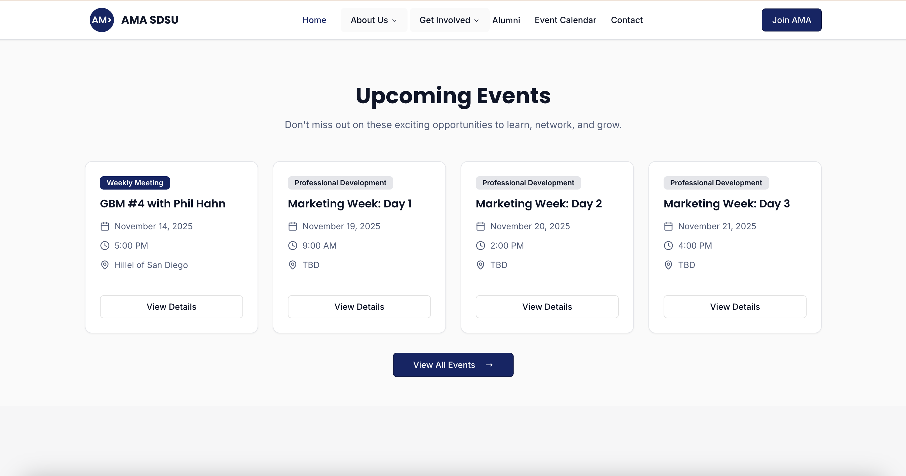

# 🎨 AMA SDSU Website — Full-Stack Redesign for a University Organization

I designed and developed the official website for the Fall 2025 **American Marketing Association at San Diego State University (AMA SDSU)**.  
This modernized platform replaced the organization’s paid website builder, saving the club **~$30/month**, while significantly improving member engagement, navigation, and branding consistency.

The website serves as the central hub for:
- Weekly meeting information  
- Committee overviews  
- Member recruitment  
- Event calendars  
- Sponsor visibility  
- Alumni outreach  
- Admin-only tools for content updates  

This redesign gave AMA SDSU a professional, scalable digital presence — and allowed the organization to fully own its branding and content without recurring platform fees.

---

## 🌐 Live Deployment
The original deployment (Replit) is no longer active, but the full source code is available and can be run locally.

---

## 📸 Screenshots

### **Homepage**


### **Meet the Team**


### **Events Page**


---

## 🚀 Features

- Fully responsive, modern UI built from scratch  
- Committee pages for Creative, Events, Podcast, Finance, and more  
- Clean event calendar showcasing weekly meetings and marketing week events  
- Sponsor carousel to highlight organizational partners  
- Admin login with session handling  
- Shared UI component system for consistent branding  
- Fast loading, accessible design  

---

## 🧰 Tech Stack

### **Frontend**
- React (TypeScript)
- Tailwind CSS  
- Custom component library  
- Responsive design system

### **Backend**
- Node.js (TypeScript)
- REST API (Express or equivalent)
- Session-based authentication  
- Drizzle ORM for structured data modeling

### **Architecture**
- Full-stack monorepo with `client/`, `server/`, and `shared/` directories  
- Shared TypeScript types between frontend and backend  
- Asset library for branding and media (`attached_assets/`)  

---

## 🛠 Run Locally

```bash
git clone https://github.com/maemansour/amawebsite
cd amawebsite
